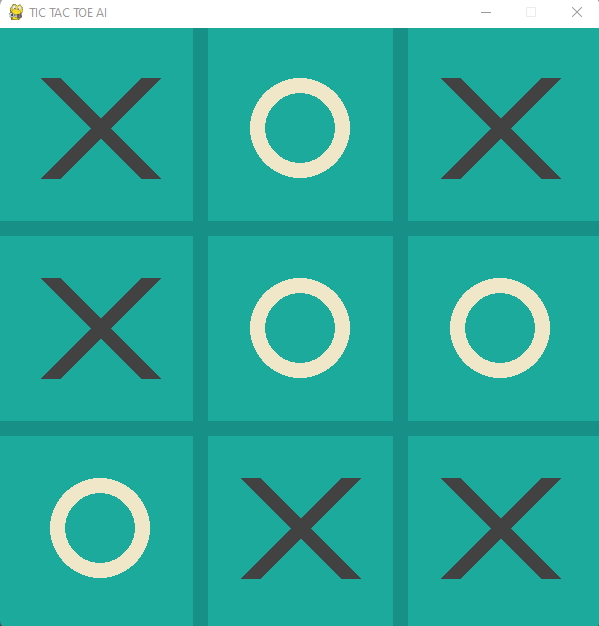

# Tic-Tac-Toe-AI
This project is basically tic-tac-toe game but with AI. It's written in Python.
I used pygame and numpy libraries along with random, sys and copy modules.
Game has 3 modes:
1. Player vs. smart AI.
2. Player vs. random moves.
3. Player vs. Player.
The transition between the modes is explained in the code.
Here is the image of game:

